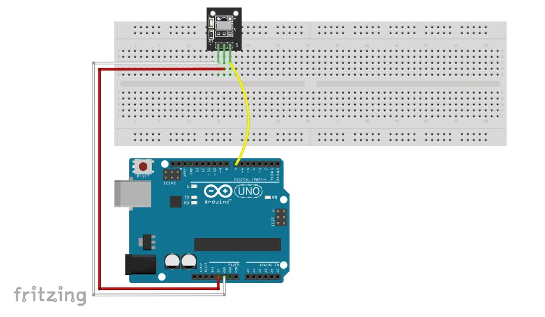
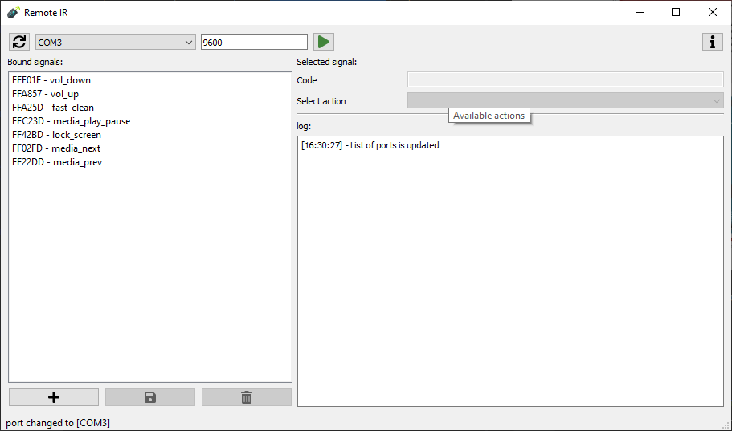

# Remote-IR
Управление компьютером при помощи IR (ИК) порта подключенного к Ардуино.

## Схема подключения Ардуино
В своей схеме я использовал отдельный модуль с IR портом распаянном на маленькой плате с smd светодиодом и резистором. Этот модуль отлично подходит для прототипирования, т.к. имеет dip пины для подключения и умеет сигнализировать при получении сигнала с пульта.
В качестве передатчика я использовал стандартный IR пульт из стартового набора.

Если будете подключать голый порт IR, то посмотрите его распиновку в сети и убедитесь, что выполнили подключение правильно.

## Скетч для Ардуино
Скетч находится в директории [arduino/RemoteIr/RemoteIR.ino](arduino/RemoteIR/RemoteIR.ino). ИСпользуется стандартная библиотека `IRremote`, которая выполняет всю работу по получению данных с порта. Скетч настроен на отправку данных через `Serial`. Дальнейшей обработкой занимается программа на Python

## Python программа без GUI
В этом проекте используется `Python` версии `3.8.2`
Все необходимые библиотеки с их версиями отображены в файле [requirements.txt](requirements.txt).
Рекомендую использовать `VirtualEnv` или любой другой инструмент для изоляции среды Python.
Для запуска программы используйте команду `python3 remote_ir.py`.

Основной код программы находится в файле [remote_ir.py](remote_ir.py). 
Конфигурационный файл для этой программы - [config.py](config.py).

Остановка программы по средствам IDE, в которой работаете. В моем случае — это [PyCharm](https://www.jetbrains.com/pycharm/).
Это не правильное решение, но оно нужно только на момент разработки GUI, т.к. консольная версия программы поддерживаться не будет.

## Графический пользовательский интерфейс (GUI)
После версии `0.1.9` разработка [remote_ir.py](remote_ir.py) приостановлена. Далее поддерживается только графическая версия ПО.

Для запуска графического режима необходимо запустить [remote_ir_gui.py](remote_ir_gui.py) при помощи команды `python3 remote_ir_gui.py`.
Используйте эту команду в пространстве `venv` в котором находятся все библиотеки из [requirements.txt](requirements.txt)

Главное окно прграммы изображено ниже.

Как пользоваться:

1) запускаем программу
2) если не подключили Адруино, подключаем и нажимаем копку обновления портов (слева от списка выбора портов).
3) выбираем необходимый порт в списке
4) выставляем рейт (Serial rate) общения с портом
5) нажимаем кнопку запуска прослушки порта

В окно лога будут приходить сообщения, по которым можно будет понять что сейчас происходит в программе.

Чтобы добавить сигнал в список, нажмите на кнопку с иконкой плюса, в поле сигналов появится шаблон с кодом `FFFFFF` и действием `empty`.
После этого отредактируйте появившуюся команду.

Чтобы отредактировать сигнал, выберите его в списке сигналов. Поле редактирования кода и поле выбора действия станут активными.
Отредактируйте код или команду, после чего нажмите на кнопку с иконкой дискеты, чтобы сохранить результат.

Чтобы удалить сигнал, выберите его в списке сигналов и нажмите на кнопку с иконкой мусорного ведра. Код удалится из списка.

ПРиятного использования Remote IR

## Использованные ресурсы
В графическом пользовательском интерфейсе используются графические ресуры из бесплатных свободных источников.

Главная иконка приложения была взята с [https://www.flaticon.com/](https://www.flaticon.com/), с пометкой о указании обязательной ссылки на источник.
Freepik</a> from <a href="https://www.flaticon.com/">www.flaticon.com </a>

Иконки для функциональных кнопок были взяты из бесплатной коллекции иконочного шрифта [fontawesome.com](https://fontawesome.com/). 

## Патч 0.1.10
* Добавлена возможность настройки рейта порта, чтобы обращаться можно было не только по `9600`.
* Добавлено дополнительное окно с информацией о программе и ссылками
* Добавлены дополнительные комментарии, изменены структуры некоторых файлов
